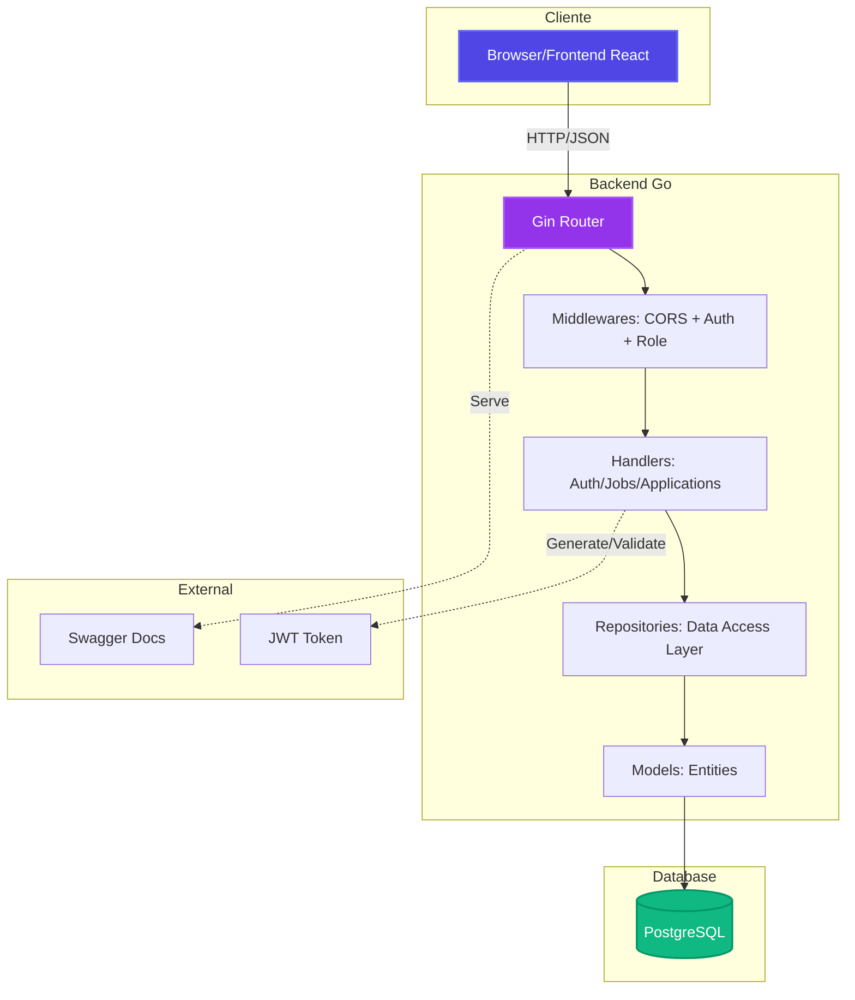
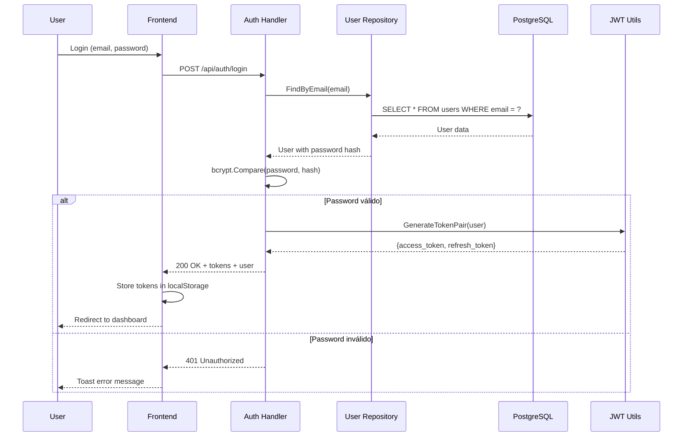
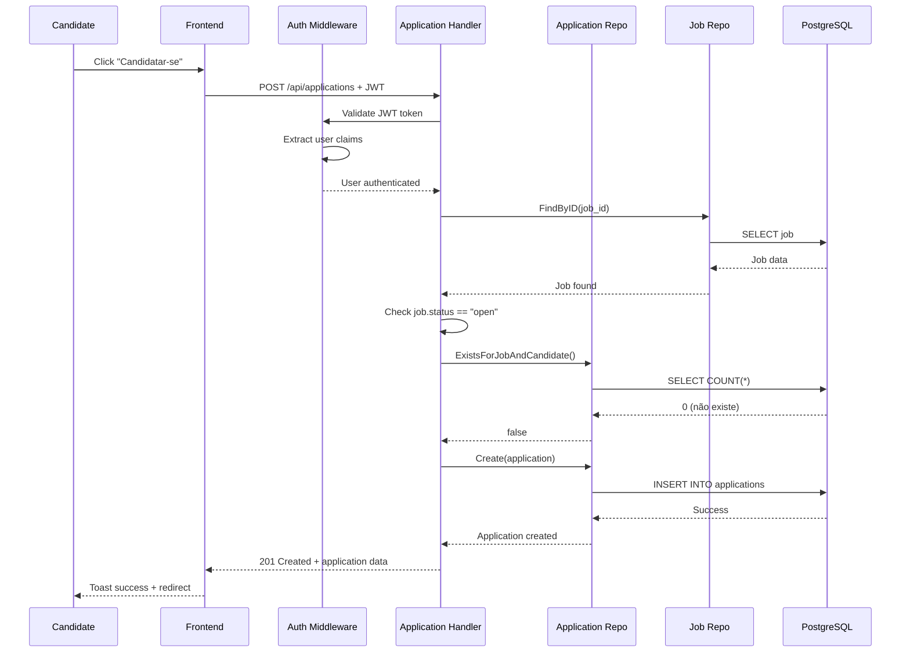
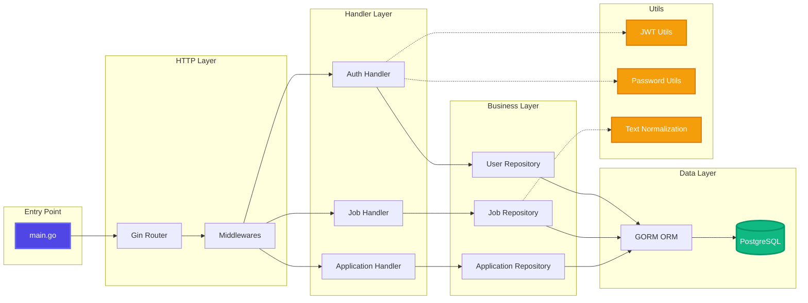
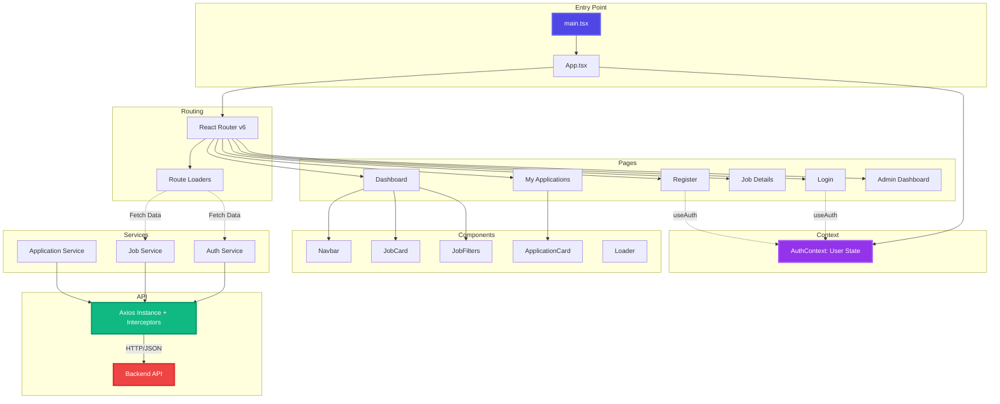
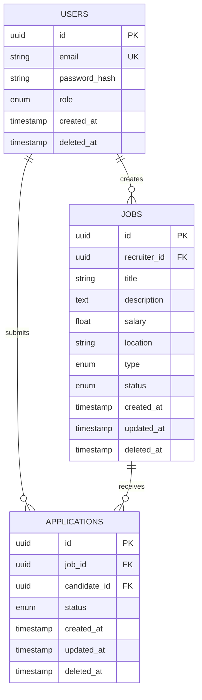
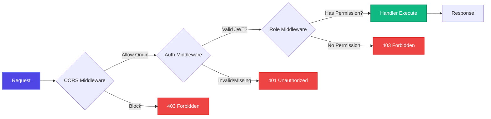

# 🎯 Sistema de Recrutamento & Seleção

Sistema completo de recrutamento com backend em **Go** e frontend em **React + TypeScript**.

## ⚡ Quick Start (30 segundos)

### **Opção 1: Setup Automático (Recomendado)**

```bash
# Na raiz do projeto
cd backend
make setup
```

Isso vai:
- ✅ Instalar todas as dependências
- ✅ Gerar documentação Swagger
- ✅ Subir containers Docker (PostgreSQL + Backend)
- ✅ Popular banco com dados de exemplo
- ✅ Deixar tudo pronto para uso!

### **Opção 2: Setup Manual**

```bash
# 1. Backend
cd backend
make install          # Instala dependências
make swagger-install  # Instala Swagger CLI
make swagger          # Gera docs
make docker-up        # Sobe containers
make seed             # Popula banco

# 2. Frontend (em outro terminal)
cd frontend
npm install
npm run dev
```

---

## 🌐 URLs de Acesso

Após o setup, acesse:

| Serviço | URL | Descrição |
|---------|-----|-----------|
| **Frontend** | http://localhost:5173 | Interface React |
| **Backend API** | http://localhost:8080/api | REST API |
| **Swagger** | http://localhost:8080/docs/index.html | Documentação interativa |
| **Health Check** | http://localhost:8080/health | Status da API |

---

## 👤 Credenciais de Teste

O comando `make seed` cria usuários de exemplo:

### 🔑 Admin (Recrutador)
```
Email: admin@recruitment.com
Senha: admin123
```

### 👥 Candidatos
```
Email: joao.silva@email.com
Senha: candidate123

Email: maria.santos@email.com
Senha: candidate123
```

---

## 🏗️ Estrutura do Projeto

```
test-prog/
├── backend/              # API em Go + Gin + GORM
│   ├── cmd/
│   │   ├── server/      # Entry point da API
│   │   └── seed/        # Script de seed do banco
│   ├── internal/
│   │   ├── handlers/    # Controllers (endpoints)
│   │   ├── middleware/  # Auth, CORS, etc
│   │   ├── models/      # Modelos do banco
│   │   └── repository/  # Data access layer
│   ├── pkg/
│   │   ├── jwt/         # Autenticação JWT
│   │   └── utils/       # Funções auxiliares
│   └── docs/            # Swagger gerado
│
└── frontend/            # SPA em React + TypeScript
    ├── src/
    │   ├── components/  # Componentes reutilizáveis
    │   ├── pages/       # Páginas da aplicação
    │   ├── contexts/    # Context API (AuthContext)
    │   ├── services/    # API calls (axios)
    │   └── types/       # TypeScript interfaces
    └── public/
```

---

## 📐 Arquitetura do Sistema

### **Visão Geral**



### **Fluxo de Autenticação**



### **Fluxo de Candidatura**



### **Arquitetura Backend (Clean Architecture)**



### **Arquitetura Frontend (React)**



### **Modelo de Dados (ER Diagram)**



### **Fluxo de Busca Inteligente**

```mermaid
graph LR
    A["User digita: desenvolvedor frontend"] --> B[Frontend envia query]
    B --> C[Backend NormalizeText]
    C --> D[Remove acentos e pontuação]
    D --> E[Split em palavras]
    E --> F[PostgreSQL translate LIKE]
    F --> G[Match com Desenvolvedor Front-End]
    G --> H[Retorna resultados]
    H --> I[Frontend exibe cards]
    
    style A fill:#4f46e5,stroke:#6366f1,stroke-width:2px,color:#fff
    style D fill:#9333ea,stroke:#a855f7,stroke-width:2px,color:#fff
    style H fill:#10b981,stroke:#059669,stroke-width:2px,color:#fff
```



### **Middleware Chain (Proteção de Rotas)**



---

## 🛠️ Comandos Úteis

### **Backend**

```bash
# Setup e Inicialização
make setup             # 🚀 Setup completo automático
make docker-up         # Subir containers
make docker-down       # Parar containers
make seed              # Popular banco com dados

# Desenvolvimento
make run               # Rodar localmente (sem Docker)
make test              # Executar testes
make swagger           # Atualizar documentação
make docker-logs       # Ver logs

# Limpeza
make docker-down-clean # Parar e limpar banco
make reset             # Reset completo (limpar + setup)
```

### **Frontend**

```bash
npm run dev            # Desenvolvimento (http://localhost:5173)
npm run build          # Build para produção
npm run preview        # Preview do build
npm run lint           # Verificar código
```

---

## 🔧 Tecnologias Utilizadas

### **Backend**
- **Go 1.21+** - Linguagem
- **Gin** - Web framework (Express do Go)
- **GORM** - ORM (Sequelize do Go)
- **PostgreSQL** - Banco de dados
- **JWT** - Autenticação
- **bcrypt** - Hash de senhas
- **Swagger** - Documentação automática
- **Docker** - Containerização

### **Frontend**
- **React 18** - UI Library
- **TypeScript** - Type safety
- **Vite** - Build tool
- **React Router v6** - Roteamento + Loaders
- **React Hook Form** - Gerenciamento de forms
- **Axios** - HTTP client
- **Tailwind CSS** - Estilização
- **React Hot Toast** - Notificações

---

## 📚 Funcionalidades

### **Para Candidatos** 👤
- ✅ Buscar vagas (com filtros inteligentes)
- ✅ Ver detalhes das vagas
- ✅ Candidatar-se a vagas
- ✅ Acompanhar suas candidaturas
- ✅ Filtros por: título, localização, tipo, salário

### **Para Recrutadores** 👨‍💼
- ✅ Criar, editar e deletar vagas
- ✅ Gerenciar vagas criadas
- ✅ Ver candidatos por vaga
- ✅ Atualizar status de candidaturas
- ✅ Dashboard administrativo

### **Sistema** ⚙️
- ✅ Autenticação JWT (access + refresh tokens)
- ✅ Busca inteligente (ignora acentos e pontuação)
- ✅ Validação de dados (backend + frontend)
- ✅ Error handling robusto
- ✅ UI/UX moderna com animações
- ✅ Responsive design
- ✅ API documentada (Swagger)

---

## 🔍 Exemplos de Uso

### **Busca Inteligente**

A busca funciona mesmo sem acentos ou pontuação:

```
✅ "desenvolvedor frontend" → Encontra "Desenvolvedor Front-End"
✅ "estagio" → Encontra "Estágio em Programação"
✅ "devops" → Encontra "DevOps Engineer"
```

### **Filtros Avançados**

```bash
# Buscar vagas remotas com salário mínimo de R$ 8.000
Filtros:
- Tipo: Remoto
- Salário Mínimo: 8.000
- Busca: "desenvolvedor"
```

---

## 🚨 Troubleshooting

### **Porta 8080 já está em uso**

```bash
# Encontrar e matar processo
lsof -ti:8080 | xargs kill -9

# Ou mudar porta no .env
PORT=8081
```

### **Erro ao conectar no PostgreSQL**

```bash
# Verificar se container está rodando
docker ps

# Recriar containers
cd backend
make docker-down-clean
make docker-up
```

### **Frontend não conecta no backend**

```bash
# Verificar variável de ambiente
cat frontend/.env

# Deve ter:
VITE_API_URL=http://localhost:8080
```

### **Swagger não aparece**

```bash
cd backend
make swagger        # Regenerar docs
make docker-restart # Reiniciar backend
```

---

## 📖 Documentação Detalhada

- **Backend**: Veja [backend/README.md](./backend/README.md)
- **API Docs**: http://localhost:8080/docs/index.html (após iniciar)

---

## 🧪 Testes

### **Backend**

```bash
cd backend
make test              # Rodar todos os testes
go test -v ./...       # Verbose
go test -cover ./...   # Com coverage
```

### **Frontend**

```bash
cd frontend
npm run test           # Se houver testes configurados
```

---

## 🐳 Docker

### **Containers**

```bash
# Ver containers rodando
docker ps

# Logs do backend
docker logs recruitment_backend -f

# Logs do PostgreSQL
docker logs recruitment_postgres -f

# Acessar shell do container
docker exec -it recruitment_backend sh
```

### **Banco de Dados**

```bash
# Conectar no PostgreSQL
docker exec -it recruitment_postgres psql -U postgres -d recruitment_db

# Ver tabelas
\dt

# Ver usuários
SELECT email, role FROM users;

# Sair
\q
```

---

## 🎨 Paleta de Cores

O sistema usa gradientes modernos:

- **Primário**: Indigo (#4f46e5) → Purple (#9333ea)
- **Secundário**: Pink (#ec4899)
- **Sucesso**: Green (#10b981) → Emerald (#059669)
- **Erro**: Red (#ef4444) → Pink (#ec4899)

---

**Pronto para começar? Execute `cd backend && make setup` e em 30 segundos estará tudo rodando! 🚀**

